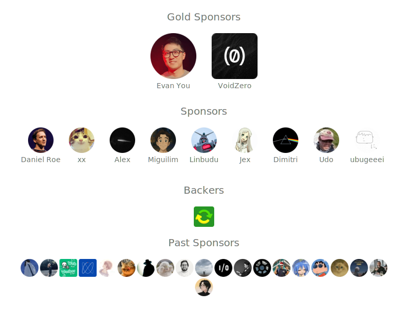

# Hi 👋

I'm webfansplz, a software engineer with a passion for open source. Active in the Vue.js ecosystem.

- Member of [@vuejs](https://github.com/vuejs), [@vueuse](https://github.com/vueuse)
- [vuejs-challenges](https://github.com/webfansplz/vuejs-challenges) - Collection of Vue.js challenges
- [temir](https://github.com/webfansplz/temir) - Vue for interactive command-line apps
- [vue-termui](https://github.com/vue-terminal/vue-termui) - The Modern Terminal UI Framework
- [vite-plugin-vue-devtools](https://github.com/webfansplz/vite-plugin-vue-devtools) - A Vite plugin designed to enhance the Vue developer experience.
- [vite-plugin-vue-inspector](https://github.com/webfansplz/vite-plugin-vue-inspector) - Jump to local editor source code while click the element of browser automatically.

**Your sponsorship means a lot to me. It will help me sustain my projects actively and make more of my ideas come true. Much appreciated! 💖 🙏**

**If my work in the open source community has been helpful to you, please consider [sponsoring me](https://github.com/sponsors/webfansplz). Thank you.**

- ♥️ [GitHub Sponsor](https://github.com/sponsors/webfansplz)

## Contact

- Twitter: [@webfansplz](https://twitter.com/webfansplz)

  

## Thanks

Built with [SponsorKit](https://github.com/antfu/sponsorkit).
